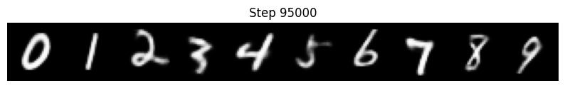
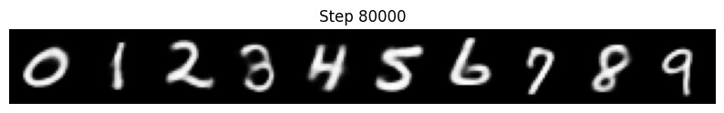
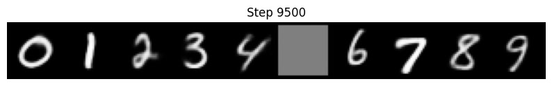

# Selective Amnesia Implementation
This is my implementation for selective amnesia, an unlearning method to be used in variational generative models like VAE and DDPM.
You can see the results here. As the model tries to unlearn class 5.

original model:

unlearned model:

